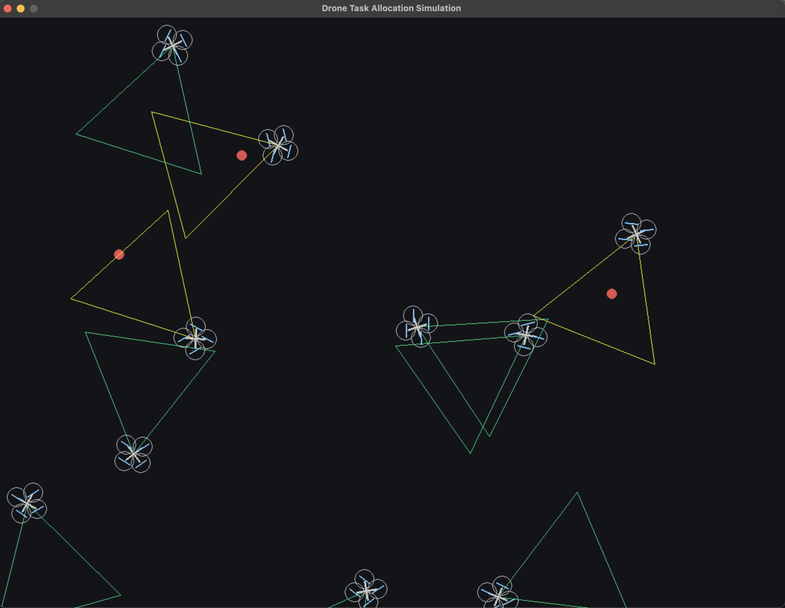

# Drone task allocation simulation

I. Project Overview

Inspired by Ken Karakotsios's CA Sim / SimLife, this project aims to build a miniature biological evolution simulator. The core concept abstracts "unicellular organisms" into individual Agents equipped with independent states and behavioral mechanisms, thereby simulating the dynamic interactions between cells and their environment.
The system faithfully recreates the life cycle of "foraging → energy consumption → satiation → reproduction → mutation → evolution → death." Over a prolonged evolutionary process, by tuning dynamic parameters, the system can effectively observe traits that are better adapted to the environment gradually propagating through the population, demonstrating a remarkable phenomenon of biological evolution.

II. Development Environment
- Programming Language: Python
- Editor / IDE: Visual Studio Code

III. Dependencies
- Pygame: Used for the visualization of the drone simulation.
- Numpy: Mathematical computing tool.

IV. Results
 
  

  	
  

 
